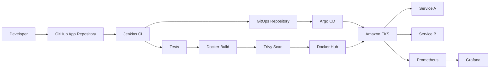

# DevSecOps CI/CD & GitOps Platform on AWS EKS

A hands-on, production-style DevSecOps project implementing an end-to-end software delivery workflow using **Jenkins, Docker, Trivy, Terraform, AWS EKS, Kubernetes, Helm, Argo CD, Prometheus, and Grafana**.

The project demonstrates the complete application and infrastructure lifecycle:

**Code → Test → Build → Scan → Push → GitOps → Deploy → Monitor**

---

## Project Overview

This project was built to implement a realistic DevOps/DevSecOps workflow across CI/CD, cloud infrastructure, Kubernetes, GitOps, security, and observability.

The application consists of two containerized microservices:

- `service-a`
- `service-b`

Application changes are processed by Jenkins, packaged as Docker images, scanned with Trivy, and pushed to Docker Hub using commit-based image tags.

Jenkins then updates the desired application version in a separate GitOps repository. Argo CD detects the GitOps change and synchronizes it to an Amazon EKS cluster.

Prometheus and Grafana provide Kubernetes and infrastructure observability.

---

## Architecture



---

## Technology Stack

| Area | Technology |
|---|---|
| Source Control | Git, GitHub |
| Continuous Integration | Jenkins |
| Containers | Docker |
| Security Scanning | Trivy |
| Container Registry | Docker Hub |
| Infrastructure as Code | Terraform |
| Cloud | AWS |
| Kubernetes | Amazon EKS |
| Package Management | Helm |
| GitOps | Argo CD |
| Monitoring | Prometheus |
| Visualization | Grafana |
| Networking | AWS VPC |
| Access Management | AWS IAM |

---

## Repository Structure

```text
Devsecops-pipeline/
├── Jenkinsfile
│
├── microservices/
│   ├── service-a/
│   │   ├── Dockerfile
│   │   └── requirements.txt
│   └── service-b/
│       ├── Dockerfile
│       └── requirements.txt
│
├── charts/
│   ├── service-a/
│   │   ├── Chart.yaml
│   │   └── values.yaml
│   └── service-b/
│       ├── Chart.yaml
│       └── values.yaml
│
├── environments/
│   ├── dev/
│   │   ├── values-service-a.yaml
│   │   └── values-service-b.yaml
│   └── prod/
│       ├── values-service-a.yaml
│       └── values-service-b.yaml
│
├── terraform/
│   ├── backend.tf
│   ├── provider.tf
│   ├── variables.tf
│   ├── vpc.tf
│   ├── eks.tf
│   ├── node-group.tf
│   ├── iam.tf
│   ├── iam-policy.tf
│   └── s3.tf
│
└── monitoring/
    └── values.yaml
```

---

# CI/CD Pipeline

The CI workflow is defined in the root `Jenkinsfile`.

A commit to the application repository triggers the Jenkins pipeline.

The pipeline performs the following workflow:

```text
GitHub
   ↓
Jenkins
   ↓
Application Tests
   ↓
Docker Build
   ↓
Trivy Security Scan
   ↓
Docker Hub
   ↓
GitOps Repository Update
   ↓
Argo CD
   ↓
Amazon EKS
```

### Pipeline Stages

The Jenkins pipeline includes:

1. Service A tests
2. Service B tests
3. Service A Docker build
4. Service B Docker build
5. Service A Trivy scan
6. Service B Trivy scan
7. Docker Hub authentication
8. Service A image push
9. Service B image push
10. GitOps repository update

Docker Hub and GitHub credentials are stored using **Jenkins Credentials** rather than hardcoded in source code.

---

## Immutable Image Tagging

Instead of continuously deploying a static image tag such as:

```text
1.0
```

the pipeline creates a unique image tag from the Git commit SHA:

```groovy
IMAGE_TAG = "${GIT_COMMIT.take(7)}"
```

Example:

```text
08321f5
```

This results in versioned container images such as:

```text
service-a:08321f5
service-b:08321f5
```

Commit-based image tagging provides:

- Deployment traceability
- Immutable releases
- Easier rollback
- Easier troubleshooting
- Direct mapping between source code and deployed containers

---

# Container Security with Trivy

Security scanning is integrated directly into the CI pipeline.

After Docker images are built, **Trivy** scans both service images before the pipeline proceeds with the registry and deployment workflow.

```text
Docker Build
     ↓
Trivy Scan
     ↓
Docker Push
```

This demonstrates a **shift-left security** approach by including vulnerability analysis as part of CI rather than relying only on post-deployment security checks.

---

# GitOps

Deployment state is separated from the application CI repository.

A separate repository is used for GitOps:

```text
Devsecops-gitops
```

After Jenkins successfully builds and pushes an application image, it updates the development image tag in the GitOps repository.

The workflow is:

```text
Application Commit
        ↓
Jenkins
        ↓
Build + Test + Scan
        ↓
Docker Hub
        ↓
Update GitOps Repository
        ↓
Argo CD Detects Git Change
        ↓
Amazon EKS Deployment
```

Git therefore becomes the source of truth for the desired Kubernetes application state.

---

# Argo CD

Argo CD continuously monitors the GitOps repository.

When Jenkins updates the desired image tags, Argo CD detects the difference between:

```text
Desired State in Git
```

and:

```text
Current State in Kubernetes
```

Argo CD then synchronizes the Kubernetes environment with the desired Git configuration.

Successful deployments were validated with the applications reporting:

```text
Healthy
Synced
```

This provides a declarative deployment model instead of having Jenkins directly execute Kubernetes deployment commands.

---

# Development and Production Environments

The project separates configuration for development and production.

```text
environments/
├── dev/
│   ├── values-service-a.yaml
│   └── values-service-b.yaml
└── prod/
    ├── values-service-a.yaml
    └── values-service-b.yaml
```

The Jenkins GitOps automation updates the **development environment**.

Production can therefore use a controlled promotion process rather than automatically deploying every application commit.

This provides environment separation and reduces the risk of uncontrolled production releases.

---

# Infrastructure as Code with Terraform

AWS infrastructure is defined using Terraform.

Terraform configuration is stored under:

```text
terraform/
```

The infrastructure included:

- AWS provider configuration
- Terraform backend configuration
- VPC
- Public subnets
- Private subnets
- Route tables
- Internet gateway
- Amazon EKS cluster
- EKS managed node group
- IAM roles
- IAM policy attachments
- S3 Terraform backend

This allowed the AWS infrastructure to be provisioned and destroyed reproducibly.

---

# AWS Networking

A dedicated VPC was created for the DevSecOps environment.

Project CIDR:

```text
172.20.0.0/16
```

The networking configuration included public and private subnets and the required routing components.

Terraform managed the relationships between:

```text
VPC
 ↓
Subnets
 ↓
Route Tables
 ↓
Route Table Associations
 ↓
Internet Gateway
```

The EKS infrastructure was deployed inside this network.

---

# Amazon EKS

Amazon EKS was used as the Kubernetes platform for the project.

The cluster hosted the application and platform workloads, including:

- Service A
- Service B
- Argo CD
- Prometheus
- Grafana
- kube-state-metrics
- node-exporter
- Prometheus Operator

An EKS managed node group supplied worker-node capacity for the Kubernetes workloads.

The node group was scaled during the project when additional resources were required for the monitoring stack.

---

# IAM

Terraform managed the IAM roles and policy attachments required by Amazon EKS and its worker nodes.

Separate responsibilities were maintained for:

- EKS cluster permissions
- Worker-node permissions
- Required AWS managed policies

AWS credentials were not embedded directly inside the Terraform configuration.

---

# Helm

Helm is used to organize reusable Kubernetes application configuration.

The repository contains charts for both microservices:

```text
charts/service-a/
charts/service-b/
```

Environment-specific values are separated into:

```text
environments/dev/
environments/prod/
```

This allows the same application deployment structure to be reused with different environment configurations.

---

# Monitoring with Prometheus and Grafana

The Kubernetes monitoring stack was deployed using Prometheus and Grafana.

Monitoring configuration is stored in:

```text
monitoring/values.yaml
```

The deployment included:

- Prometheus
- Grafana
- kube-state-metrics
- node-exporter
- Prometheus Operator

Alertmanager was disabled for the current lab implementation.

Configuration:

```yaml
alertmanager:
  enabled: false

grafana:
  enabled: true

prometheus:
  enabled: true

kubeStateMetrics:
  enabled: true

nodeExporter:
  enabled: true

prometheusOperator:
  enabled: true
```

---

## Grafana Observability

Grafana dashboards were used to visualize Kubernetes and infrastructure metrics collected by Prometheus.

The monitoring stack provided visibility into areas such as:

- Cluster health
- Node utilization
- CPU usage
- Memory utilization
- Pod state
- Kubernetes workloads
- Resource consumption

This completed the observability portion of the DevSecOps lifecycle.

---

# End-to-End Deployment Flow

A complete application change follows this path:

```text
Developer pushes code
        ↓
GitHub receives commit
        ↓
Jenkins pipeline starts
        ↓
Service tests execute
        ↓
Docker images are built
        ↓
Trivy scans the images
        ↓
Images receive commit-based tags
        ↓
Images are pushed to Docker Hub
        ↓
Jenkins updates GitOps values
        ↓
GitOps commit is pushed
        ↓
Argo CD detects the change
        ↓
Kubernetes performs the rollout
        ↓
New application pods become available
        ↓
Argo CD reports Healthy / Synced
        ↓
Prometheus collects metrics
        ↓
Grafana provides visualization
```

---

# Security Practices

Security controls were incorporated across multiple layers.

### Container Security

Trivy scans container images as part of CI.

### Credential Management

GitHub and Docker Hub credentials are stored in Jenkins Credentials rather than hardcoded in the repository.

### AWS IAM

AWS permissions are managed through IAM roles and policies.

### Infrastructure as Code

Infrastructure configuration is version-controlled through Terraform.

### GitOps

Deployment changes are represented through Git commits, providing deployment history and traceability.

### Terraform State Protection

Terraform state files are intentionally excluded from Git.

Files such as:

```text
terraform.tfstate
terraform.tfstate.backup
.terraform/
terraform-state-backup.json
```

must not be committed because Terraform state can contain infrastructure details and potentially sensitive values.

---

# Terraform Remote State

During the active project lifecycle, Terraform remote state was stored in an S3 backend.

The state object used a path similar to:

```text
devsecops/terraform.tfstate
```

Remote state allowed Terraform infrastructure state to be stored independently from the local development machine.

The backend was removed only after the AWS infrastructure had been successfully destroyed and verified.

---

# Infrastructure Teardown

The project also demonstrates safe cloud infrastructure decommissioning.

After the complete CI/CD, GitOps, Kubernetes, and monitoring workflow was validated, the AWS infrastructure was intentionally destroyed to avoid unnecessary cloud resource usage.

Terraform-managed resources were removed using:

```bash
terraform destroy
```

The destruction completed successfully with:

```text
17 resources destroyed
```

The AWS environment was then audited using AWS CLI commands.

The final project-region audit confirmed there were no remaining project resources for:

- EC2 instances
- EBS volumes
- Elastic IP addresses
- EKS clusters
- Application/Network Load Balancers
- NAT Gateways
- RDS instances
- ElastiCache clusters
- ECS clusters
- Lambda functions

The dedicated project VPC was also destroyed.

Only the normal AWS **default VPC** remained.

Finally, the Terraform state object was removed from S3 and the Terraform backend bucket was deleted.

This demonstrates an important infrastructure engineering principle:

> Infrastructure lifecycle management includes both reliable provisioning and safe decommissioning.

---

# Recreating the Infrastructure

The infrastructure can be recreated from the Terraform configuration when required.

Typical workflow:

```bash
cd terraform
terraform init
terraform plan
terraform apply
```

After the Kubernetes infrastructure is available, the GitOps and monitoring components can be deployed again.

> **Note:** The remote S3 backend used during the original lab was intentionally deleted during teardown. A new backend must be created/configured before using the same remote-backend configuration again.

---

# Successful Validation

The complete delivery path was successfully tested:

```text
GitHub
   ↓
Jenkins
   ↓
Tests
   ↓
Docker
   ↓
Trivy
   ↓
Docker Hub
   ↓
GitOps Repository
   ↓
Argo CD
   ↓
Amazon EKS
   ↓
Prometheus
   ↓
Grafana
```

Commit-based Docker images successfully propagated through Jenkins, GitOps, Argo CD, and Kubernetes.

---

# Key DevOps / SRE Concepts Demonstrated

This project provides hands-on implementation of:

- CI/CD pipeline design
- Git and GitHub workflows
- Microservices
- Docker containerization
- Immutable image versioning
- Container vulnerability scanning
- Jenkins pipelines
- AWS infrastructure
- Terraform IaC
- VPC networking
- IAM
- Amazon EKS
- Kubernetes
- Helm
- GitOps
- Argo CD
- Development/production separation
- Kubernetes rolling deployments
- Prometheus monitoring
- Grafana dashboards
- Infrastructure troubleshooting
- Cloud resource auditing
- Infrastructure teardown
- Cloud cost awareness

---

# Future Improvements

The project can be extended with:

- Path-based Jenkins builds so Terraform/monitoring-only commits do not rebuild application images
- SonarQube static code analysis
- Trivy severity-based pipeline gates
- Checkov Terraform security scanning
- Terraform validation in CI
- Kubernetes NetworkPolicies
- AWS Secrets Manager integration
- External Secrets Operator
- HTTPS ingress
- AWS Load Balancer Controller
- Prometheus alerting rules
- Alertmanager notifications
- Centralized application logging
- OpenTelemetry
- Automated production promotion
- Policy as Code with OPA
- Jenkins Kubernetes agents

---

# Lessons Demonstrated

This project was designed not simply to deploy containers, but to understand how the individual DevOps components interact.

Key areas practiced included:

- Debugging Jenkins pipeline failures
- Managing Docker image versions
- Understanding why immutable tags matter
- Troubleshooting Kubernetes deployments
- Understanding GitOps reconciliation
- Working with Argo CD health and synchronization
- Provisioning EKS through Terraform
- Managing IAM dependencies
- Scaling Kubernetes worker capacity
- Deploying an observability stack
- Auditing AWS resources after teardown
- Protecting Terraform state from source control

---

# Author

**Anudeep Neerulli Girishchandra**

DevOps | Cloud | Site Reliability Engineering

### Technologies

`AWS` `Terraform` `Kubernetes` `EKS` `Docker` `Jenkins` `Trivy` `Helm` `Argo CD` `Prometheus` `Grafana` `GitHub` `GitOps`

---

## Project Purpose

The purpose of this project is to demonstrate practical experience across the complete modern DevOps lifecycle:

```text
Code
  ↓
Continuous Integration
  ↓
Testing
  ↓
Containerization
  ↓
Security Scanning
  ↓
Artifact Publishing
  ↓
GitOps
  ↓
Kubernetes Deployment
  ↓
Observability
  ↓
Infrastructure Lifecycle Management
```

The project combines application delivery, infrastructure automation, security, GitOps, Kubernetes, monitoring, troubleshooting, and cloud resource management into one end-to-end implementation.